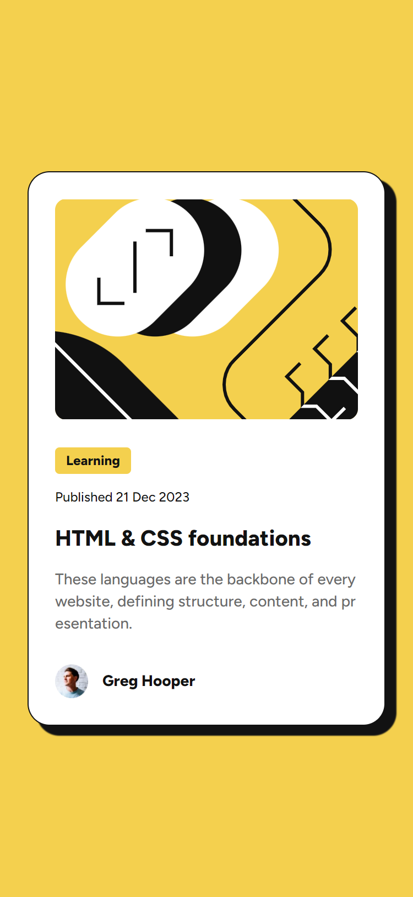
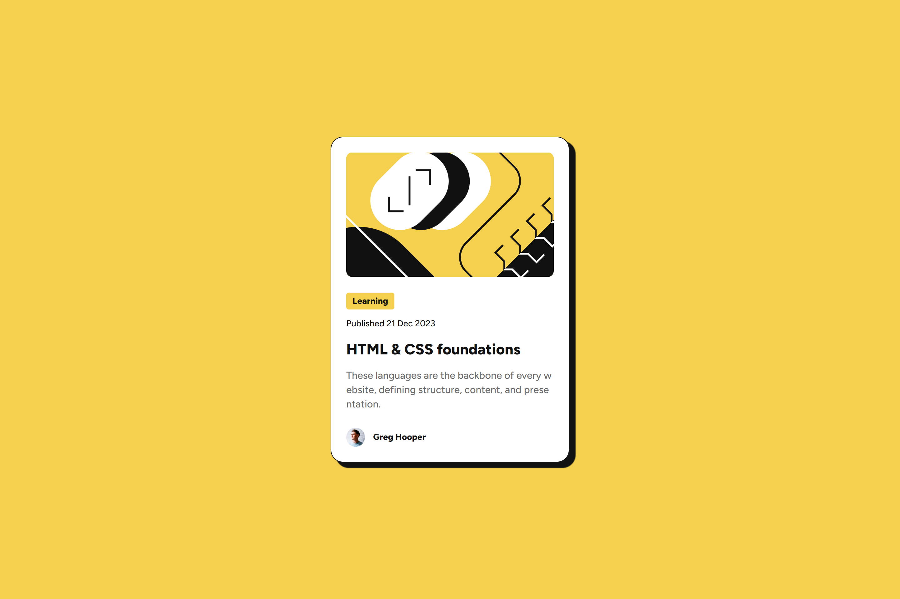
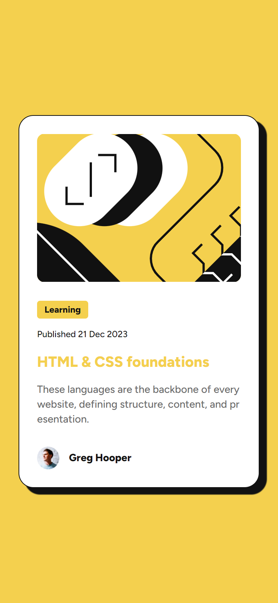

# Frontend Mentor - Blog preview card solution

This is a solution to the [Blog preview card challenge on Frontend Mentor](https://www.frontendmentor.io/challenges/blog-preview-card-ckPaj01IcS). Frontend Mentor challenges help you improve your coding skills by building realistic projects. 

## Table of contents

- [Overview](#overview)
  - [The challenge](#the-challenge)
  - [Screenshot](#screenshot)
  - [Links](#links)
- [My process](#my-process)
  - [Built with](#built-with)
  - [What I learned](#what-i-learned)
    - [Introduction](#introduction)
    - [Card as a reusable component](#card-as-a-reusable-component)
    - [Meanings of the elements](#meanings-of-the-elements)    
    - [SASS & BEM](#sass--bem)    
    - [Accessibility](#accessibility)         
  - [Continued development](#continued-development)
  - [Useful resources](#useful-resources)
- [Author](#author)
- [Acknowledgments](#acknowledgments)

## Overview

### The challenge

- Users should be able to:
    - See card layout for the proposed course/article
    - See hover and focus states for all interactive elements on the page

### Screenshot

<table>
  <thead>
    <th>Mobile</th>
    <th>Desktop</th>
    <th>Hover</th>
  </thead>
  <tbody>
    <tr>
      <td></td>
      <td></td>
      <td></td>
    </tr>
  </tbody>
</table>

### Links

- Solution URL: [GitHub](https://github.com/MiloosN5/FrontendMentor_BlogPreviewCard)
- Live Site URL: [GitHub Pages](https://miloosn5.github.io/FrontendMentor_BlogPreviewCard/)

## My process

### Built with

- Semantic HTML5 markup
- SASS/SCSS
    - mixins, functions, variables
- BEM
- Flexbox
- Mobile-first workflow
- REM (Root EM) & EM (for Responsive)
- Responsive layout
- [React](https://reactjs.org/) - JS library
- Components

### What I learned

#### Introduction

Each Frontend Mentor challenge helps me improve my coding organization. In this particular example, despite the simple layout, it's important to organize your code to be reusable, understandable, and clean. The key is to think about how this could evolve into a larger website (not just a single card layout). 
This card layout can be split into three parts: <br>

  - Header
  - Main content
  - Footer

#### Card as a reusable component

Since there can be many of these cards with the same layout, the right approach is to first think about the skeleton and then take care of the data. For this purpose, we create `<Card/>` component. The data varies between card instances, so we use  something called 'props' in React to pass dat to each card. Due to simplicity of the challenge and the focus on frontend, the database is mocked with Javascript file. Each object in this array of cards will have the same properties but different values. Thanks to the built-in "map" function (`Array.prototype.map()`), we can efficiently create each card instance.  

```jsx
  {/* App.jsx */}

  {
    cards.map((card, index) => (
      <Card key={index} item={card}></Card>
    ))
  }
```

```js
// cards.js

export const cards = [
    {
        graphics: {
            src: PromoImage,
            alt: 'Promo image for the corresponding course/article'
        },
        label: 'Learning',
        published: 'Published 21 Dec 2023',
        title: 'HTML & CSS foundations',
        desc: 'These languages are the backbone of every website, defining structure, content, and presentation.',
        author: {
            avatar: {
                src: AuthorImage,
                alt: 'Profile picture of the author'
            },
            name: 'Greg Hooper'
        }

    },
    {...},
    {...}
]
```

#### Meanings of the elements

There is also role of semantic meaning in HTML elements. Using a generic `<div />` will produce the same visual result as using semantic elements, but semantically meaningful tags provide additional context for developers and screen readers. The reason for choosing `<article` for the card is that this layout can be independent of the rest of the website and retain its meaning if placed elsewhere. These semantic elements were introduced in HTML5. In this example, there is some of them I observed:

  - `<figure>` -> for promo graphics (image)
  - `<time>` -> for representing aa date (in a specific format) - translate dates into machine-readable format, allowing for better search engine results or custom features such as reminders  [source: MDN]
  - `<footer>` -> a footer typically contains information about the author of the section, copyright data or links to related documents. [source: MDN]
    - `<address>` -> indicates that the enclosed HTML provides contact information for a person or people, or for an organization. [source: MDN] 

#### SASS & BEM

One of the trickiest parts of my learning experience has been SASS. It helps you better organize your styling code with features like mixins, functions, and variables. Additionally, using BEM is also helpful to consistently maintaining a clear project structure. However, in each of my projects I have expermented with different variations to improve the organization for future scalability. 

One of the challenges is determining whether a case is individual or can be applied to multiple parts of the website. This is evident in this example with the 'card'. The BEM naming convention consists of three parts: B (block), E (element) & M (modifier). The problem arises when one block contains multiple other blocks, and deep nesting in the name convention is not recommended (e.g. card__wrapper__header__graphics). There are also situations like the 'sr-only' class, which visually shifts content outside the viewport for accessibility but keeps it accessible to screen readers. Since this class can be used in multiple places on the website, its name can be independent of the 'card' block. For instance, if a class is specific to this one case, it could be named 'card__sr-only', but if it applies to multiple cases, it might be named 'sr-only--modifierName', or simply 'sr-only' if it is the sme across all cases.

```html
  <article className='card'>
    <div className='card__wrapper'>
      <header className='card__header'>
        <figure className='card__graphics'>
          
          <figcaption className='sr-only'></figcaption>
        </figure>
        <div className='card__meta'>
          <span className='card__category'></span>
          <time className='card__date'></time>
        </div>
      </header>
      <div className='card__content'>
        <h3 className='card__title'></h3>
        <p className='card__desc'></p>
      </div>
      <footer className='card__footer'>
        <address className='card__author'>
          
          <span className='card__author-name'></span>
        </address>
      </footer>
    </div>
  </article>
```

#### Accessibility

In addition to the 'sr-only' class mentioned earlier, accessibility can be further enhanced with more features. This challenge provides a card layout as one part of a bigger layout. Since there is no additional information about the rest of the website, I decided to include a simple hero section that helps users relying on accessibility tools, while keeping it hidden from the visual UI to avoid spoiling the design.

```html 
  <section className='hero sr-only'>
    <h1 className='hero__title'>Pick your courses/articles for learning</h1>
  </section>
```

### Continued development

My goal is to improve the organization of code for better readability, reusability, HTML structure, and SASS/BEM usage.

### Useful resources

- [How to Build Reusable React Components](https://www.freecodecamp.org/news/how-to-build-reusable-react-components/) - Creating reusable components can lead to better organization, more readability, and better management of data changes. 
- [@mixin and @include](https://sass-lang.com/documentation/at-rules/mixin/) - Having all logic in one place is more practical, not only for reusability but also for an easier way to handle changes in style behavior.
- [Semantic HTML](https://www.semrush.com/blog/semantic-html5-guide/) - The basic HTML structure can initially be done using only generic elements. As you improve your code, you can replace these generic elements with semantic ones to help both yourself and other developers.
- [Accessibility](https://blog.logrocket.com/design-accessibility-css-visually-hidden-class/) - Accessibility can help improve your code and assist users who rely on auditory senses, while also helping you better understand the meaning behind your code. Using 'sr-only' (or a similar class) is just one of the steps to make your website more accessible.

## Author

- GitHub - [MiloosN5](https://github.com/MiloosN5)
- Frontend Mentor - [@MiloosN5](https://www.frontendmentor.io/profile/MiloosN5)
- Exercism [milos-novakovic-pro](https://exercism.org/profiles/milos-novakovic-pro)
- LinkedIn [Milos Novakovic](https://www.linkedin.com/in/milos-novakovic-1a9517263/)


